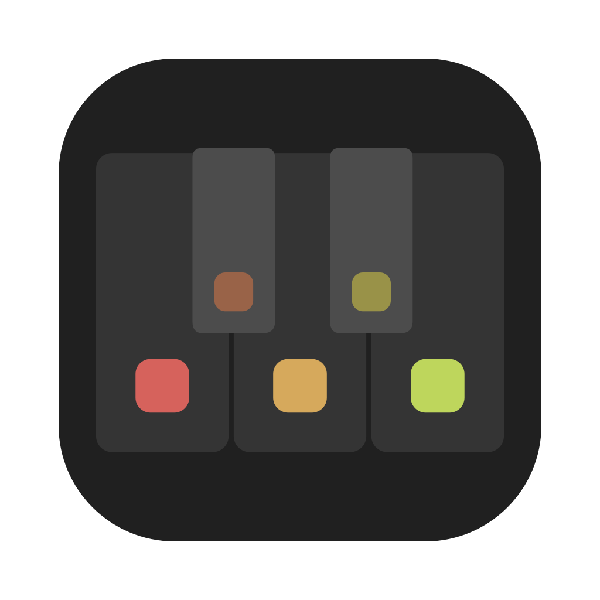
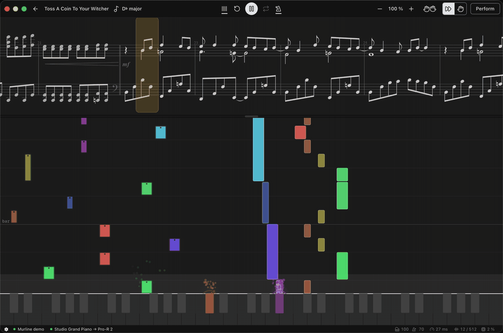
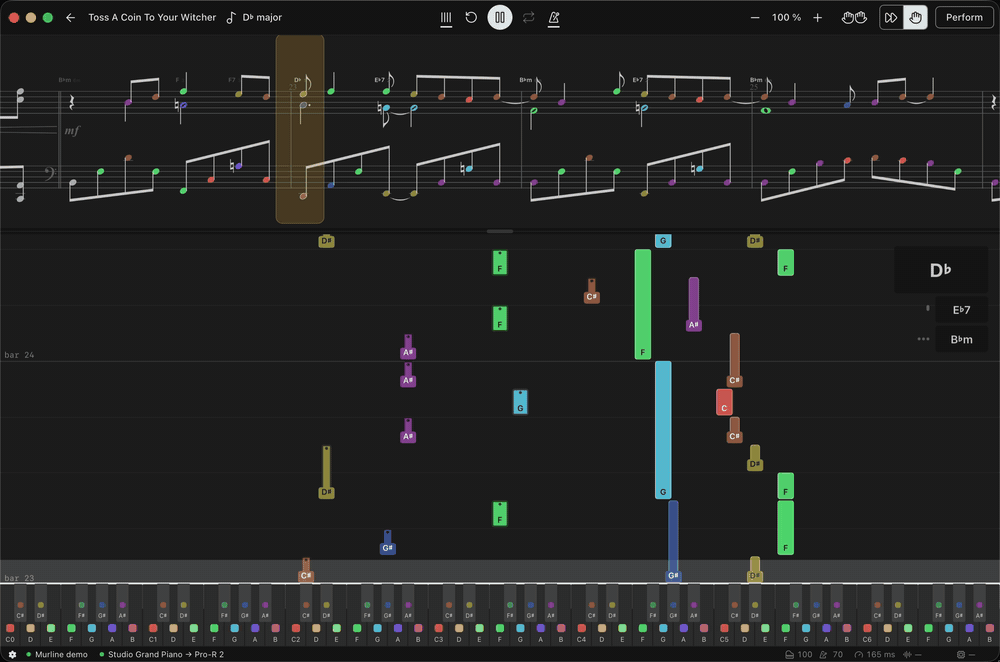
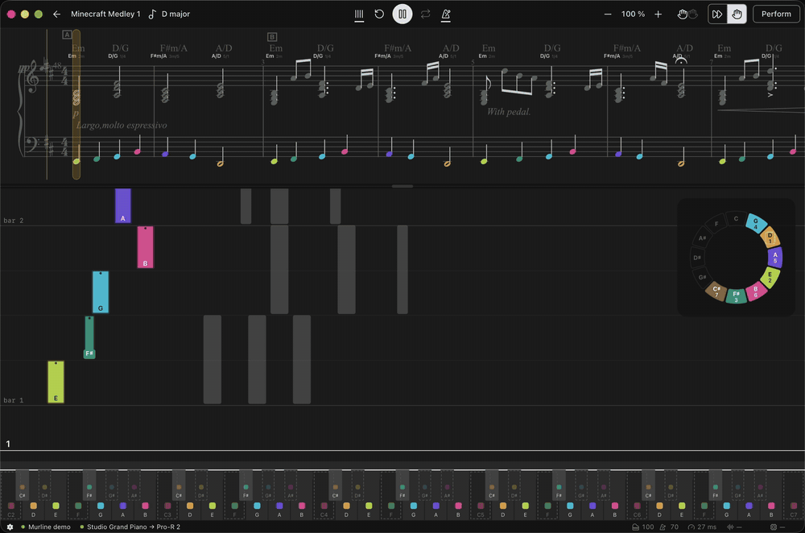
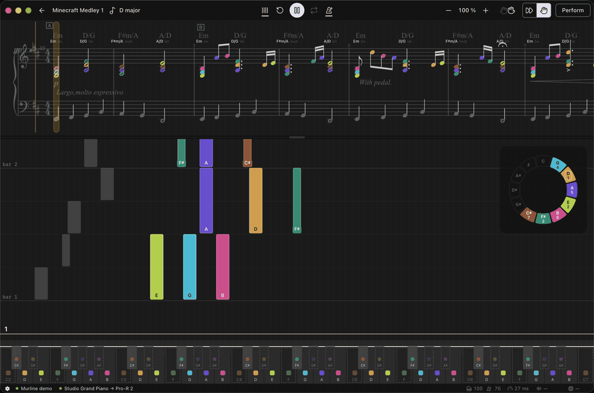
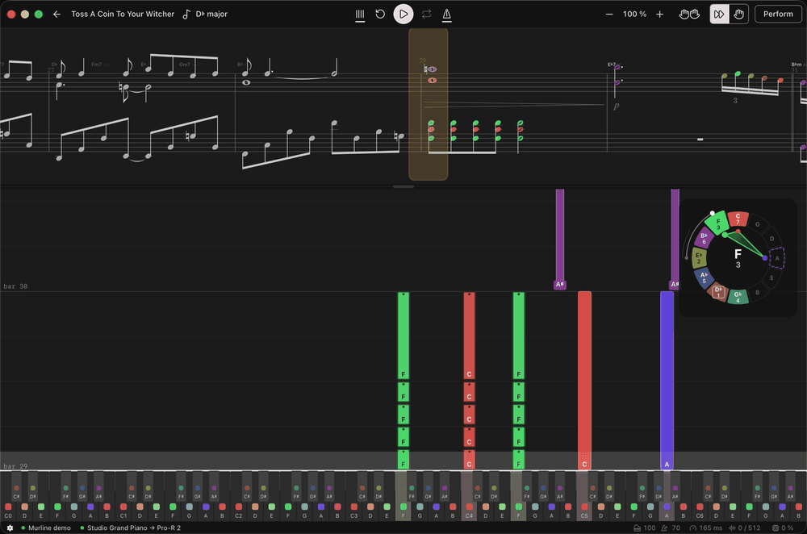
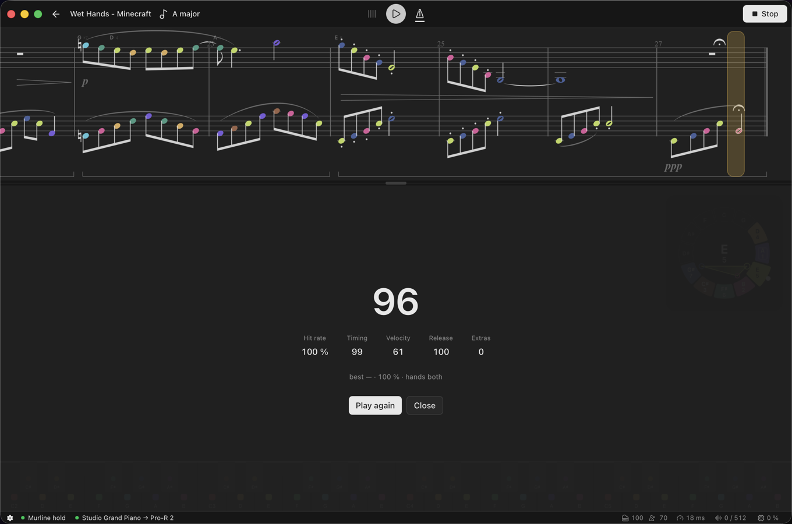
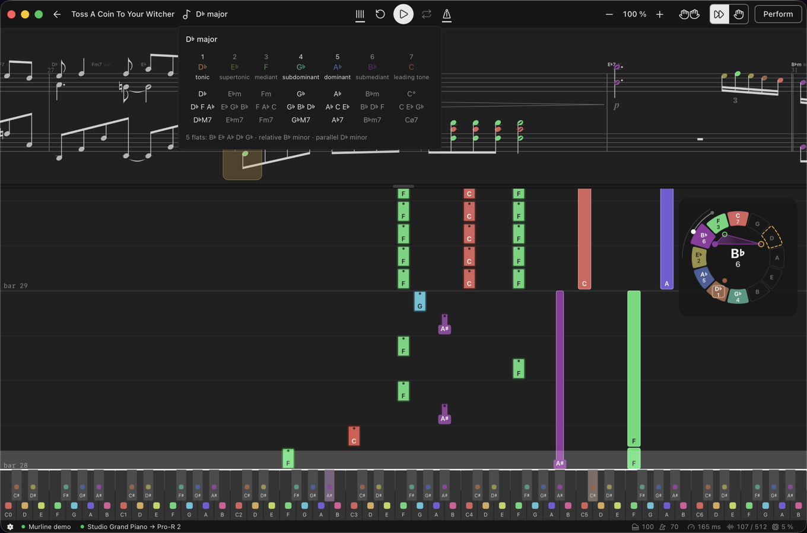
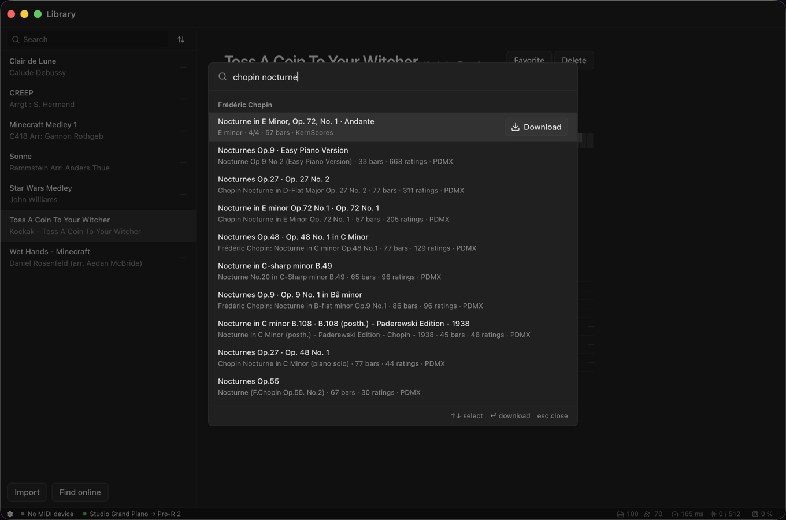
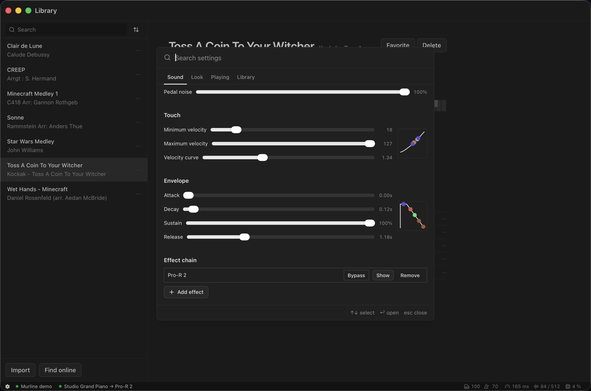

<div align="center">



# Murline

**Modern ADHD friendly piano practice app for real sheet music**

[](https://github.com/ssankko/murline/actions/workflows/ci.yml)
[](https://github.com/ssankko/murline/releases)
[](LICENSE)


<p align="center">
  
</p>

</div>

## What can it do?

Murline opens a MusicXML score and shows the sheet and the falling notes at the same time. You play along on a MIDI keyboard, and the chord names, the key and the wheel of fifths stay on the same screen.

I made it for myself. I am a beginner with a MIDI keyboard on the desk, and none of the apps I tried fit the way I wanted to practice. Piano roll apps read MIDI files, and MIDI is not what pianists read. Yousician lets you play only what it has licensed, and only after its lessons. What I ended up with was Logic for its pianos, a stack of PDF scores with chord names written on them by hand, and a couple of browser tabs with theory.

Murline is my attempt to fit that practice flow in one screen to eliminate distraction and frustration.

## Features

### Practice without the frustration

The start is the hardest part of piano. Reading, two hands and rhythm all arrive at once, and that is where most beginners give up. **Murline** lets you climb those walls one at a time.

#### Classic wait mode

In wait mode the piece waits until you play the right notes. A passage you can already play goes by without interruption, and one you cannot play yet holds at that moment until you find the notes. Playback never rewinds, so a wrong note costs you one moment instead of the whole phrase.

<p align="center">
  
</p>

#### One hand at a time

Every keyboardist has to play with two hands eventually. Until then you can play one part while the app plays the other, and you hear the whole piece while you learn half of it.

<p align="center">
  
  
</p>

#### Drill one part of a piece

Drag over a few bars on the sheet, turn loop on, and practice that loop till your muscle memory does it for you automatically. It's often easier to train separate parts or the melody until you are confident in them, instead of trying to absorb whole piece at once.

<p align="center">
  
</p>

#### Perform when you are ready

Practice is never scored, because there is nothing to score while you are still learning the notes. There is a separate performance mode for that. You play the whole piece and get one grade from 0 to 100. It accounts for hit timings, release timing, (best-effort) velocity matching, and counts your hits and misses, so you can see what went wrong and where you can improve. Performance mode needs more love, since I've yet to perform to grade and it's not fully tweaked yet.

<p align="center">
  
</p>

### Learn to read while you play

Studied on its own, reading a score takes years. It takes much less if the score is on the screen every time you play and you sneakily sight-read it while you play.

#### Pitch coloring

Color in the app means mostly one thing - pitch. Every pitch has one color, and it is the same everywhere. Over time your eyes learn to recognize them and you start associating a color with music note. Colored sheet for me stops being a wall of black dots and becomes relatively easy to parse at a glance. As reading gets easier you can turn the colors off, and become a "real" pianist.

#### Theory on the play screen

Most beginner apps leave the theory out, and I wanted to see the inside of the music while I play it. We generate harmony and chords information for the piece on the fly, so the app shows it as an additional info as chords ("G7/B") and as degrees of the key ("5⁷/7"). There is also the wheel of fifths that shows the seven notes of the key in their colors and draws the sounding chord through its tones. The key in the top bar opens a table of every degree with its triad, its seventh chord and the relative and parallel keys as an additional juicy cheatsheet.

<p align="center">
  
</p>

#### Real sheet music

Drop a MusicXML file on the window, or search KernScores and PDMX from inside the app and download the score into your library with a couple of clicks. The library is a folder you own. Edit it with any tool you like and the app won't complain.

<p align="center">
  
</p>

### Nothing between you and the keys

I practise when starting is easy. An app that needs five clicks and a settings dialog before it plays again is an app I never open again.

#### No ceremony

Open the app and the piece is where you left it in two clicks, with the settings you left it on. Settings apply live while the piece plays, without reloading. I aim to never have to apply those twice. Movement within a score is a one-click procedure, and you can use your keyboard to return to previous notes or bars without a mouse, so it's quite comfortable. There are many things to make shortcuts for, so feel free to bring them to my consideration.

#### Your own sound

Load an EXS or a SoundFont, or host any Audio Unit instrument (maybe VST later too). I am picky about piano sound, so I built the engine to play samples / instruments you already have. Logic studio pianos get some love from me, so release samples, key-off noise, resonance and pedal noise each play and are configurable, to produce great sound. Also you can attach a chain of Audio Unit effects before the output, because a little reverb never hurts anyone. You also can configure velocity curve how you like it and tweak ADSR envelope for sampler instruments.

<p align="center">
  
</p>

#### It moves with the music

I like my apps to be reactive and responsive. In this case, app pulses on the beat with metronome, so it visually "clicks" for you and also you get a pleasant reaction from it when you do good and play right notes. Small rewards and movement are what keeps me at the keyboard when I would otherwise get bored.

## Platforms

Consider this list "works on my machine".

| | macOS | Windows |
| --- | --- | --- |
| Sheet, falling notes, MIDI input | ✅ | ✅ |
| Wait mode, loops, scoring, theory | ✅ | ✅ |
| Score finder | ✅ | ✅ |
| EXS and SoundFont sampler | ✅ | ✖️ |
| Audio Unit instruments and effects | ✅ | ✖️ |

The sound engine is macOS only for now, so a Windows build does not produce sound. If you want to, you can run any MIDI instrument of your choosing alongside the app till I get a Windows machine for comfortable testing. Or you can make a PR with it.

There is much to fix and improve yet, so if you encounter some bug or frustrating behaviour, open an issue.

## Install

Take the `.dmg` from the [releases page](https://github.com/ssankko/murline/releases) and drag Murline into Applications. The build is not signed with an Apple Developer ID, so macOS refuses the first launch until you clear the download flag:

```sh
xattr -dr com.apple.quarantine /Applications/Murline.app
```

Once is enough. From then on the version at the right of the status bar tells you when a newer one is out, with an amber arrow beside the number. Press it to fetch that version; press the green check that follows to start it at once, or leave it and it starts the next time you open the app. Nothing downloads until you press it.

To build it yourself you need macOS, [Rust](https://rustup.rs) 1.96 or newer, and [pnpm](https://pnpm.io).

```sh
git clone https://github.com/ssankko/murline.git
cd murline
pnpm install
pnpm dev             # run with hot reload
pnpm tauri build     # .app and .dmg under src-tauri/target/release/bundle/
```

On first launch pick a library folder. Drop a MusicXML file on the window or open the score finder.

## FAQ

**Why is this FAQ empty?**
Nobody asked me questions yet, so go ahead.

## How it is built

Rust handles the machine: the library folder, the score finder, MIDI input through `midir` and the sound engine with its EXS/SoundFont sampler and Audio Unit hosting through `objc2`. React 19 and TypeScript handle the visuals and MusicXML parsing, since [OpenSheetMusicDisplay](https://opensheetmusicdisplay.org) is picky on the input side.

`CONTEXT.md` is the glossary. Every term in the code has one name there.

## Development

```sh
pnpm dev                                  # run the app
pnpm build                                # typecheck and build the frontend
pnpm test                                 # Vitest, node and browser projects
cd src-tauri && cargo test                # Rust tests
```

I build the two provider indexes by hand and commit them:

```sh
node scripts/kernscores-index.mjs      # listings from scripts/cache/, else the live site -> src-tauri/index/kernscores.json
python3 scripts/pdmx-index.py <file>   # PDMX.csv from Zenodo -> src-tauri/index/pdmx.tsv
```

Files under `src/components/ui/` are stock shadcn. Do not edit them by hand; the next `pnpm dlx shadcn@latest add <name> --overwrite` throws the edit away.

## Roadmap

Nothing here is promised, just a short list of ideas I find amusing.

- [ ] Shortcut settings and MIDI input bindings
- [ ] Windows and VST audio support
- [ ] Movable theory overlays

- [ ] MIDI files support??

- [ ] Guitar pro (.gp) files support??
- [ ] Tablature visualisation??
- [ ] Drums support (whaaat)??

- [ ] Second audio instrument channel for voice
- [ ] Record mode and MIDI output

## Data sources

The score finder searches two indexes I build and commit: `src-tauri/index/kernscores.json` from [KernScores](https://kern.ccarh.org) listings and `src-tauri/index/pdmx.tsv` from the [PDMX](https://zenodo.org/records/15571083) dataset. The scores themselves download from those sites, not from this repo, and each file keeps the licence its collection gives it. Check the collection before you publish anything you made from a download.

The test scores under `src/score/fixtures/` and `src-tauri/fixtures/` are encodings of public-domain works: three from the [OpenSheetMusicDisplay](https://github.com/opensheetmusicdisplay/opensheetmusicdisplay) demo (Bach BWV 846, Clementi Op. 36 No. 1, Joplin's The Entertainer), the rest exported from KernScores and PDMX, plus a few bars I wrote by hand.

## License

[AGPL-3.0-or-later](LICENSE)
